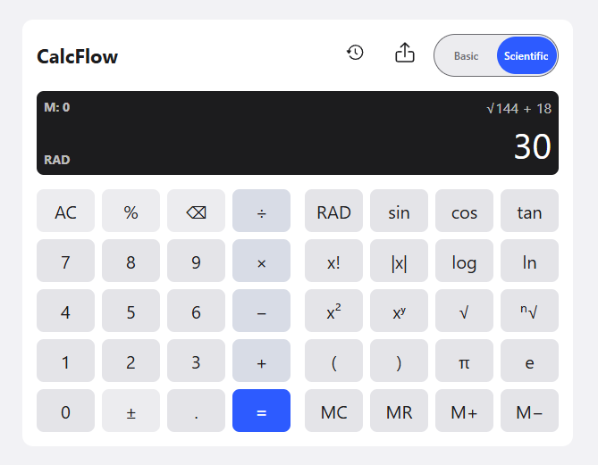

# CalcFlow

A frontend-only scientific calculator built with React and Vite — clean expression editing, a full scientific mode, calculation history, memory operations, and full keyboard/accessibility support.

[](https://github.com/eldaduz/CalcFlow/actions/workflows/ci.yml)
[](https://calc-flow-fawn.vercel.app/)
[](package.json)
[](#license)

**Live app:** https://calc-flow-fawn.vercel.app/



## Table of Contents

- [Features](#features)
- [Tech Stack](#tech-stack)
- [Getting Started](#getting-started)
- [Available Scripts](#available-scripts)
- [Project Structure](#project-structure)
- [Testing and Quality](#testing-and-quality)
- [Deployment](#deployment)
- [Releases](#releases)
- [Project Governance and Documentation](#project-governance-and-documentation)
- [License](#license)

## Features

CalcFlow ships as a single calculator surface with a Basic / Scientific mode toggle. Basic mode covers everyday arithmetic; Scientific mode reveals additional controls alongside the same expression flow, display, and error recovery.

**Basic**

- Addition, subtraction, multiplication, and division, including decimals and negative values
- Multi-step expression entry with parentheses, by button or keyboard
- Operator precedence and nested parentheses, evaluated by a hand-written recursive-descent parser (no `eval`)
- Clear, delete, sign toggle, and in-place recovery from a controlled error without losing the expression being edited

**Scientific**

- Powers and roots: square (`x²`), general power (`xʸ`), square root (`√`), and nth root (`ⁿ√`)
- Logarithms: `log` (base-10) and `ln` (natural), as real inline expression functions (e.g. `log(100)+5`)
- Trigonometric functions `sin`, `cos`, `tan`, with a DEG/RAD angle mode that persists for the session and immediately re-evaluates the active result when switched
- Percent (postfix divide-by-100), absolute value (`|x|`), factorial (`x!`, validated up to `170!`), and the constants `π` and `e`
- Controlled, recoverable errors for every domain case (division by zero, negative/fractional factorial, non-positive logarithm input, undefined tangent, etc.) — the invalid expression stays on screen for editing rather than resetting

**History and memory**

- Collapsible calculation history: every successful expression and result, each reusable (restores the full editable expression) and independently clearable; persists for the session via `sessionStorage`
- Memory operations (`MC`, `MR`, `M+`, `M−`) in Scientific mode, surviving `AC` and controlled errors — only `MC` clears memory

**Keyboard, responsive, and accessible**

- Full keyboard entry: digits, operators, parentheses, decimal point, Enter/Backspace/Escape, and the complete Scientific-mode shortcut set, plus a `?`-triggered shortcuts-help panel
- Responsive layout verified at phone, tablet, and desktop widths with no horizontal overflow and full-size touch targets
- Keyboard-only operable; results and errors are announced to assistive technology via distinct live regions

**Logging and evidence**

- Internal application logging: successful calculations, controlled errors, and unexpected evaluator failures are recorded in-memory with a timestamp and structured detail, isolated so a logging failure can never break a calculation
- One header export menu downloads the real calculation log (`Export Logs`) and a separate, deliberately comedic button-press/telemetry log (`Export Telemetry`) as distinct JSON files — see [logs/README.md](logs/README.md)
- Dependency and asset licensing tracked in [ALL_LICENSES](ALL_LICENSES)

## Tech Stack

| Layer      | Choice                                                           |
| ---------- | ---------------------------------------------------------------- |
| UI         | React 19                                                         |
| Build tool | Vite 8                                                           |
| Language   | JavaScript (ES modules, no TypeScript)                           |
| Testing    | Vitest 4 + jsdom, `@vitest/coverage-v8`                          |
| Linting    | ESLint 9, `eslint-plugin-react*`                                 |
| Formatting | Prettier 3                                                       |
| Git hooks  | Husky + lint-staged                                              |
| CI         | GitHub Actions                                                   |
| Hosting    | Vercel (auto Preview per PR, auto Production on merge to `main`) |

No backend, database, or authentication — CalcFlow is intentionally frontend-only (see [docs/agents/PROJECT_PLAN.md](docs/agents/PROJECT_PLAN.md)).

## Getting Started

### Prerequisites

- Node.js `^20.19.0 || >=22.12.0`
- npm `11.16.0` (the pinned project package manager)

### Installation

```sh
npm ci
```

`npm ci` installs the exact locked dependency set from `package-lock.json` — use this over `npm install` for a reproducible environment.

### Run locally

```sh
npm run dev
```

Then open the printed local URL in a browser.

## Available Scripts

| Command                  | Description                                   |
| ------------------------ | --------------------------------------------- |
| `npm run dev`            | Start the local development server            |
| `npm run build`          | Create the production build in `dist/`        |
| `npm run preview`        | Serve the production build locally            |
| `npm run lint`           | Lint JavaScript and JSX with ESLint           |
| `npm run lint:fix`       | Apply safe ESLint fixes                       |
| `npm run format`         | Format the repo with Prettier                 |
| `npm run format:check`   | Check formatting without writing              |
| `npm test`               | Run the unit test suite once                  |
| `npm run coverage`       | Run tests and produce a coverage report       |
| `npm run release:verify` | Run the release-readiness verification script |

## Project Structure

```text
src/
├── main.jsx                          # React application entry point
├── App.jsx                           # Application shell
├── components/
│   ├── Calculator.jsx                 # State/dispatch and layout wiring
│   ├── Display.jsx                    # Expression/result display, live regions
│   ├── Keypad.jsx                     # Basic and Scientific button grids
│   ├── History.jsx                    # Collapsible calculation history
│   ├── ExportMenu.jsx                 # Header export menu (logs + telemetry)
│   ├── ShortcutsHelp.jsx              # `?`-triggered keyboard shortcuts panel
│   ├── CookieBanner.jsx               # Parody cookie-consent banner
│   └── icons/                         # Inline icon components (History, Export)
├── calculator/expression/
│   └── evaluateExpression.js          # Tokenizer + recursive-descent evaluator
├── lib/
│   ├── expressionEngine.js            # Expression editing/display-glyph state
│   ├── arithmetic.js                  # +, −, ×, ÷
│   ├── logarithm.js                   # log10 / ln
│   ├── scientificOperations.js        # Factorial, absolute value
│   └── logger.js                      # In-memory structured event logging
├── assets/icons/                      # Source SVG icon assets
└── styles/calculator.css              # Design tokens and component styles

tests/                                 # Vitest unit/integration tests, one suite per module above
```

See [design.md](design.md) for the full UI/UX design system.

## Testing and Quality

```sh
npm ci
npm run lint
npm run format:check
npm test
npm run coverage
npm run build
```

This is the same pipeline enforced in CI on every pull request and on `main`. As of the last recorded full pipeline run (2026-08-02): 288/288 tests passing, 97.21% statement coverage, clean lint/format, and a clean production build — see [docs/agents/SECOND_BRAIN.md](docs/agents/SECOND_BRAIN.md) for the live-updated evidence trail per Feature.

## Deployment

CalcFlow deploys to [Vercel](https://calc-flow-fawn.vercel.app/) directly from this repository: every pull request gets an automatic Preview deployment, and every merge to `main` deploys to Production automatically — no manual deploy step. See [docs/DEPLOYMENT.md](docs/DEPLOYMENT.md) for build settings, the full deployment flow, and recorded smoke-test evidence.

## Releases

Tagged releases and notes are published under [GitHub Releases](https://github.com/eldaduz/CalcFlow/releases). `v0.1.0` through `v0.5.0` are tagged and shipped (MVP arithmetic through calculation history and memory). Everything through `v0.6.0` (keyboard support, responsive interface, accessibility) and beyond — including logging, log export, and license reporting — is merged, deployed, and verified live in Production; the final `v1.0.0` tag and GitHub Release are the one remaining release-management step. See [docs/RELEASE_GUIDE.md](docs/RELEASE_GUIDE.md).

## Project Governance and Documentation

CalcFlow is built with disciplined Agile delivery — Jira-tracked work items, one Git branch and pull request per Feature, mandatory peer review, and a documented QA/regression/deployment/smoke-test cycle for every change. Both human maintainers work with AI coding agents (Claude and OpenAI Codex/AGY IDE) under the same process and approval rules.

| Document                                                   | Purpose                                                    |
| ---------------------------------------------------------- | ---------------------------------------------------------- |
| [docs/agents/PROJECT_PLAN.md](docs/agents/PROJECT_PLAN.md) | Scope, ownership, Jira/Git workflow, QA, and release rules |
| [design.md](design.md)                                     | Shared UI and UX rules                                     |
| [docs/DEPLOYMENT.md](docs/DEPLOYMENT.md)                   | Vercel deployment approach and smoke-test evidence         |
| [docs/DEPENDENCIES.md](docs/DEPENDENCIES.md)               | Dependency governance and audit policy                     |
| [docs/RELEASE_GUIDE.md](docs/RELEASE_GUIDE.md)             | Versioning and GitHub Release process                      |
| [ALL_LICENSES](ALL_LICENSES)                               | Third-party dependency and asset licensing                 |
| [logs/README.md](logs/README.md)                           | How the committed submission log is produced and reviewed  |
| [docs/agents/SECOND_BRAIN.md](docs/agents/SECOND_BRAIN.md) | Live operational handoff (current state, next safe action) |

## License

All rights reserved. No license is granted to use, copy, modify, or distribute this source code; source visibility on a public repository does not imply permission. Third-party dependency and asset licenses this project depends on are recorded in [ALL_LICENSES](ALL_LICENSES).
